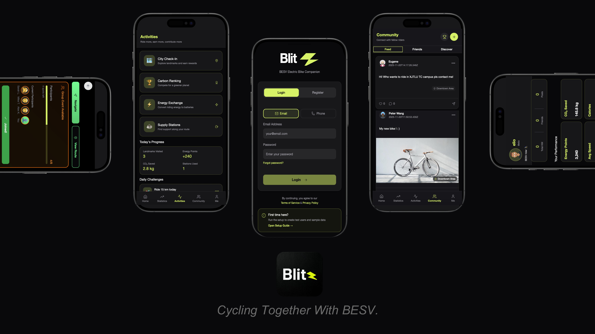
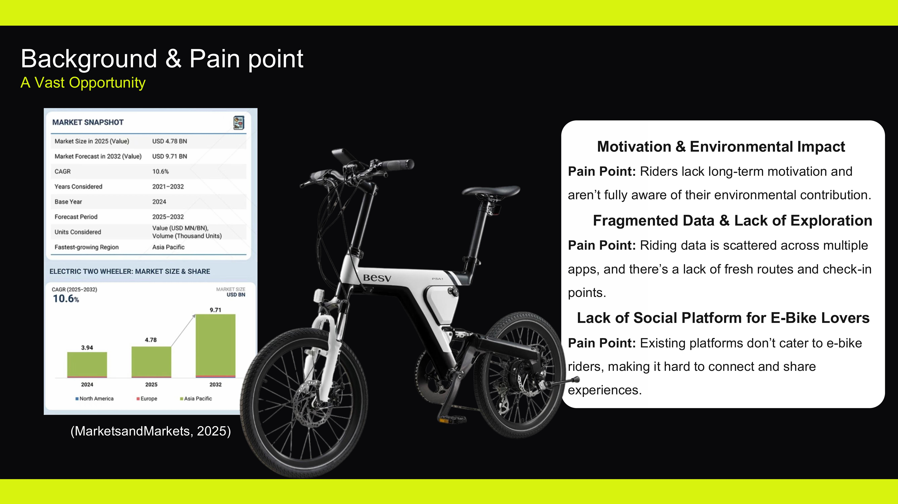
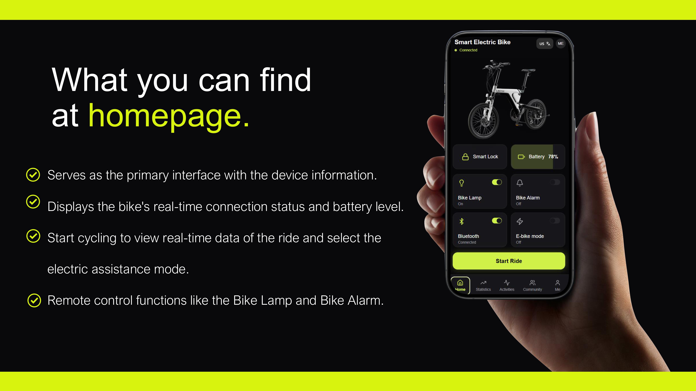
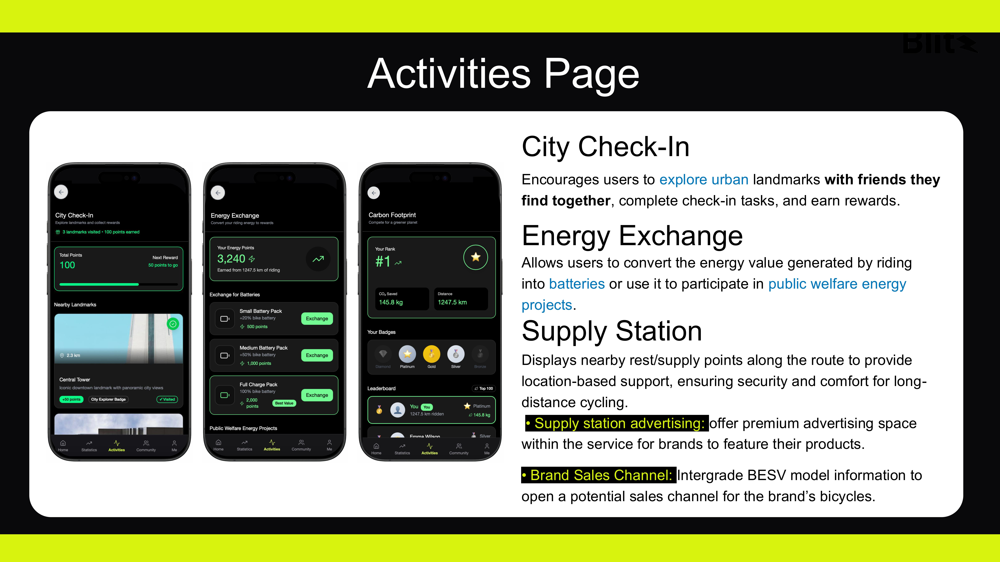
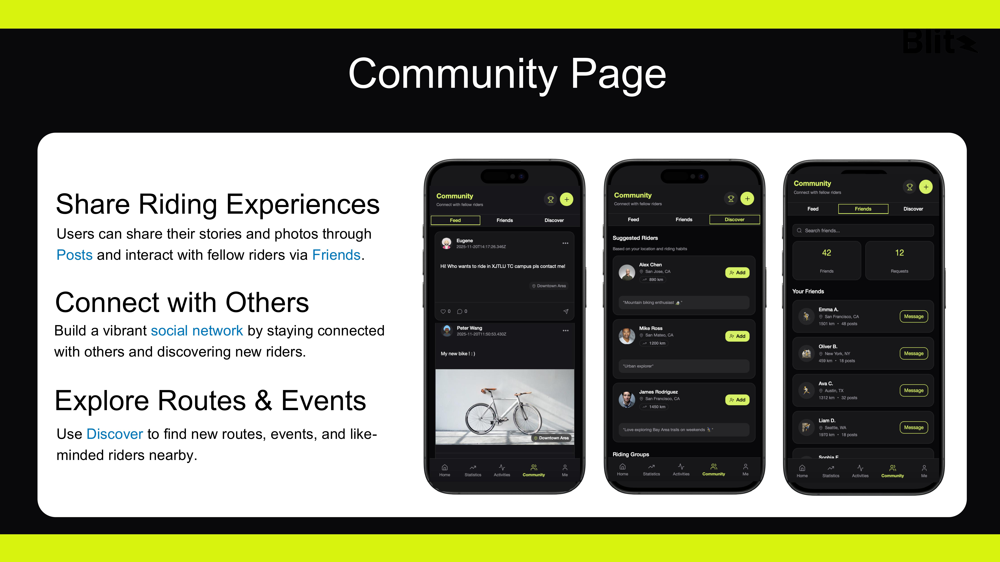
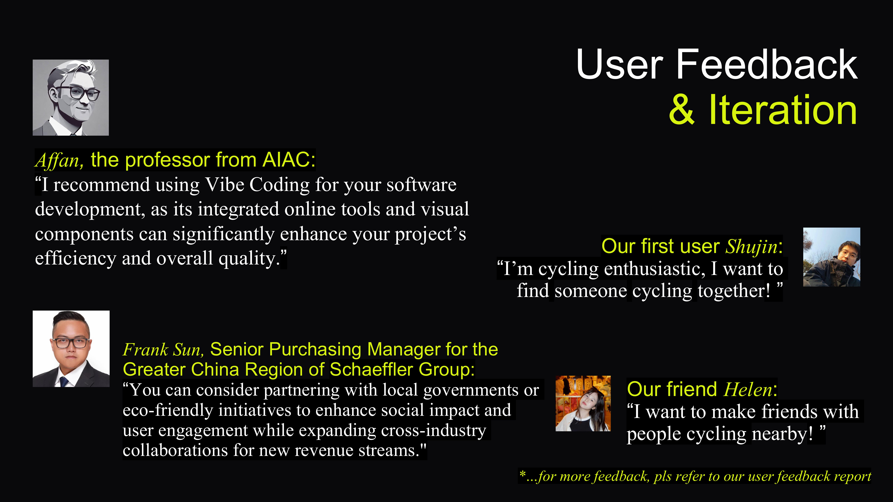
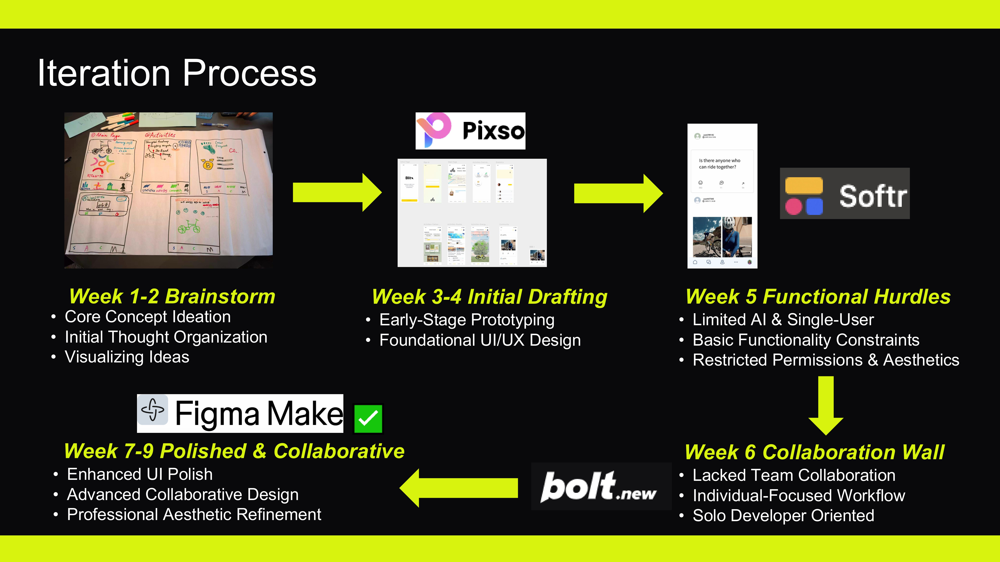
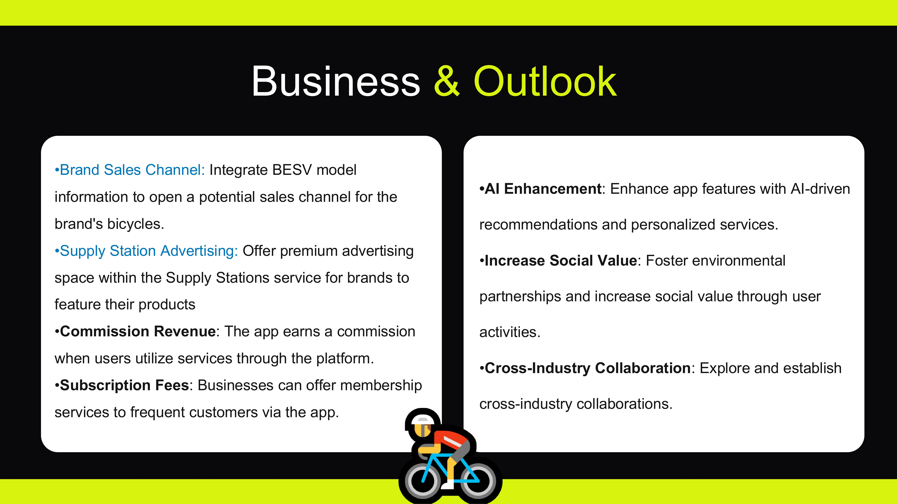

# Blitz - BESV Smart Electric Bike Companion 🚲

[**English Version**](#english-version) | [**中文版本**](#chinese-version)

---

## 🌟 1. Project Overview & Value
**Blitz** is a premium digital ecosystem designed for **BESV** electric bicycles. Beyond a simple utility app, Blitz integrates hardware status, urban culture-tourism, and social sustainability into a seamless user experience.

### Why Blitz? (Problem & Solution)

* **The Problem:** Fragmented cycling data, lack of social connection for high-end riders, and low engagement in eco-friendly habits.
* **Our Solution:** A unified platform that gamifies "Green Energy," rewards urban exploration, and fosters a high-quality community.

---

## 🚀 2. Core Features

### Dashboard & Navigation (Main Page)

* **Hardware Sync:** Real-time monitoring of battery, mileage, and smart lock status.
* **Intuitive Navigation:** Map-centric design for seamless city riding.

### Gamified Activities

* **City Check-in:** Turn cycling into a cultural journey with landmark rewards.
* **Carbon Ranking:** Real-time leaderboard for CO2 reduction to incentivize green travel.
* **Green Energy Exchange:** Convert physical effort (climbing/distance) into battery packs or charity donations.

### Community Hub

* **Social Connection:** Discover nearby riders and join groups based on shared interests or proximity.
* **Personal Performance:** Track long-term environmental impact and earned badges.

---

## 🛠️ 3. Technical Implementation
* **High-Fidelity Prototyping:** Built with **Figma**, featuring complex interactive components and logic flows.
* **Data-Driven Design:** Connected to a live database via Figma plugins to drive **Mock/Demo data**, ensuring a realistic user experience during testing.
* **AI Enhancement:** The promotional video was co-created with **OpenAI's Sora**, demonstrating advanced capabilities in leveraging AI to visualize brand vision and software interactions.

---

## 📈 4. Design Process & Iteration

* **Feedback-Driven:** We conducted extensive user testing and integrated direct feedback to refine navigation paths and reward mechanisms.
* **Collaborative Workflow:** Managed through a professional design-to-dev pipeline, demonstrating a full lifecycle from research and design to feedback iteration while utilizing AI tools for efficient production.

---

## 🔮 5. Business Potential & Outlook

* **Revenue Streams:** Integrated brand sales channels, premium advertising for supply stations, and commission-based services.
* **Future Roadmap:** AI-driven personalized route recommendations and predictive hardware maintenance.

---

## 🔗 Quick Access
* **[Live Demo App (Figma)](https://wrist-pager-97681795.figma.site)**
* **[Project Landing Page](https://blink-verify-48103483.figma.site/)**
* **[Promo Video (YouTube)](https://youtu.be/-PWxabQaLvQ)** | **[Bilibili](https://www.bilibili.com/video/BV1HAS1BQEh9/)**
* **Account:** `test@test.com` | **Password:** `Testuser1`

---

## 🌟 1. 项目简介与价值
**Blitz** 是专为 **BESV** 电动自行车设计的高端数字化生态系统。它不仅是一个工具软件，更是一个整合了硬件监控、城市文旅与社交可持续发展的全方位体验平台。

### 为什么选择 Blitz? (痛点与解决方案)

* **痛点分析：** 骑行数据碎片化、高端骑行者缺乏社交连接、绿色出行习惯缺乏持久动力。
* **解决方案：** 通过“绿能积分”游戏化系统、城市探索奖励和高品质社群，打造完整的软硬件闭环。

---

## 🚀 2. 核心功能介绍

### 智能仪表盘 (主页)

* **硬件同步：** 实时监控电量、里程及智能锁状态。
* **直观导航：** 以地图为中心的设计，为城市骑行提供无缝导航。

### 活动模块

* **城市打卡：** 将骑行转化为文旅探索，打卡著名景点获取奖励。
* **碳足迹排名：** 实时减排排行榜，激励用户坚持绿色出行。
* **绿能兑换：** 强调“运动产生能量”，将爬升与距离转化为积分，兑换电池或参与公益项目。

---

## 🛠️ 3. 技术实现
* **高保真原型：** 使用 **Figma** 构建，包含完整的页面跳转逻辑与复杂交互组件。
* **数据驱动：** 原型连接了后台数据库，通过 **Mock/Demo 数据** 驱动页面展示，确保了测试时的真实交互感。
* **AI 工具赋能：** 项目宣传视频采用了 **OpenAI Sora** 辅助制作。通过灵活运用前沿 AI 工具，将品牌愿景与软件体验进行了高效的视觉化呈现。

---

## 📈 4. 项目过程与反馈

* **用户驱动迭代：** 基于多轮用户反馈与测试，我们对导航路径和奖励权重进行了深度优化。
* **团队协作与 AI 工作流：** 项目涵盖了从市场调研、交互设计到用户反馈的完整链路，并展示了如何借助 AI 提升内容产出与团队协作效率。

---

## 🔮 5. 商业化与未来规划

* **商业模式：** 包含品牌直销渠道集成、驿站精准广告位、以及服务佣金分成。
* **未来展望：** 计划引入 AI 驱动的个性化路线推荐系统及硬件预测性维护。

---

## 🔗 快速链接
* **[软件在线演示 (Figma)](https://wrist-pager-97681795.figma.site)**
* **[宣传 Landing Page](https://blink-verify-48103483.figma.site/)**
* **[宣传视频 (YouTube)](https://youtu.be/-PWxabQaLvQ)** | **[B站](https://www.bilibili.com/video/BV1HAS1BQEh9/)**
* **测试账号：** `test@test.com` | **密码：** `Testuser1`

---
© 2026 Blitz Project Team. Built with Figma & AI (Sora).
